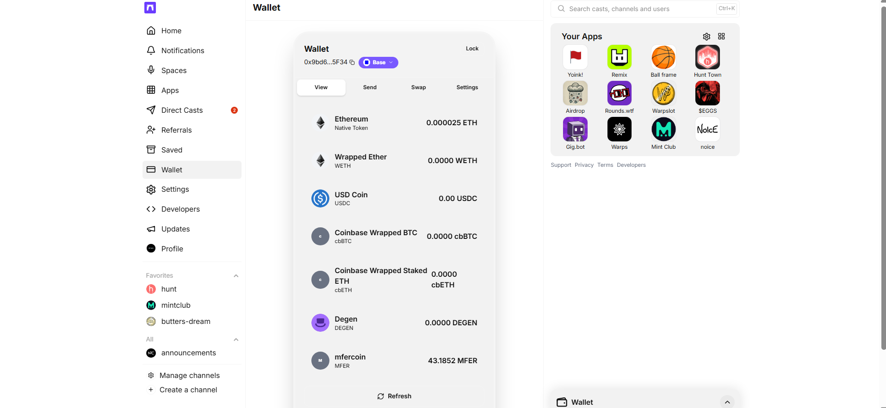
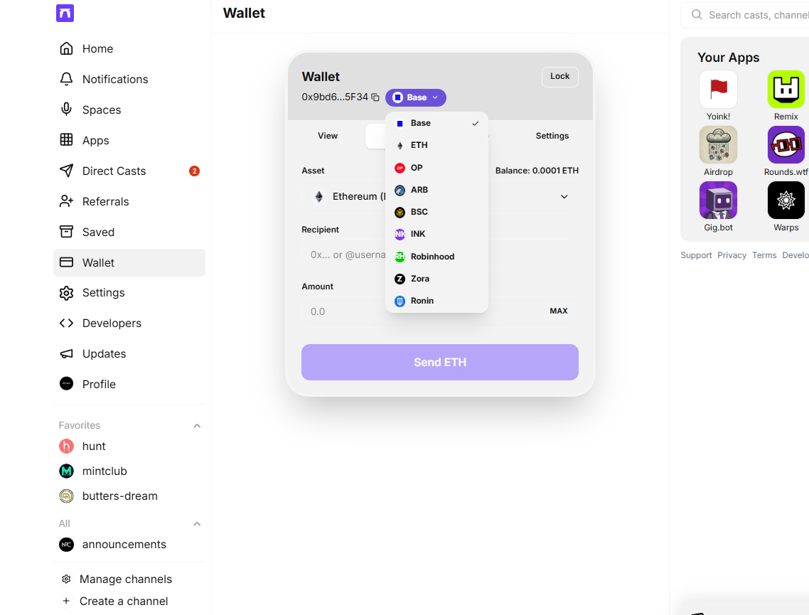
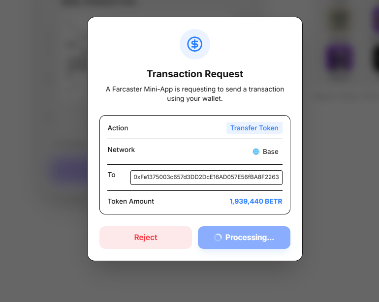
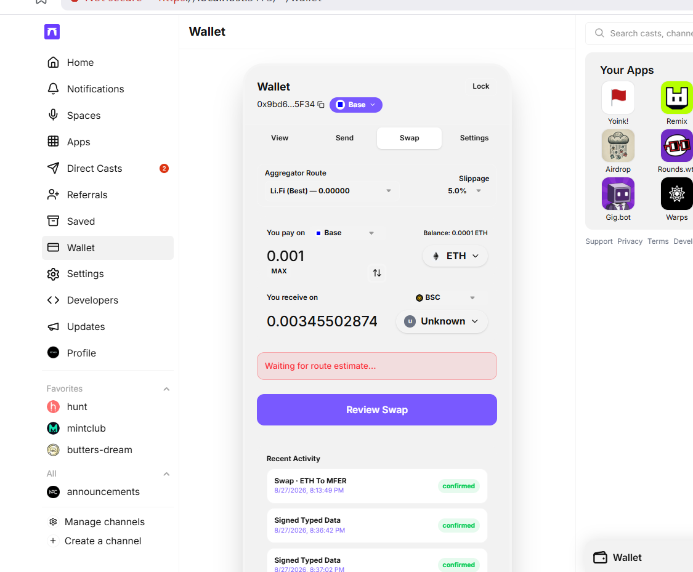
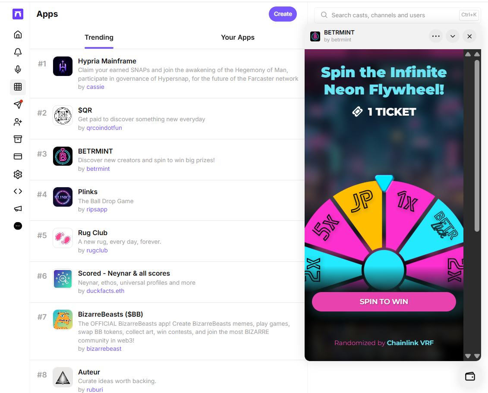
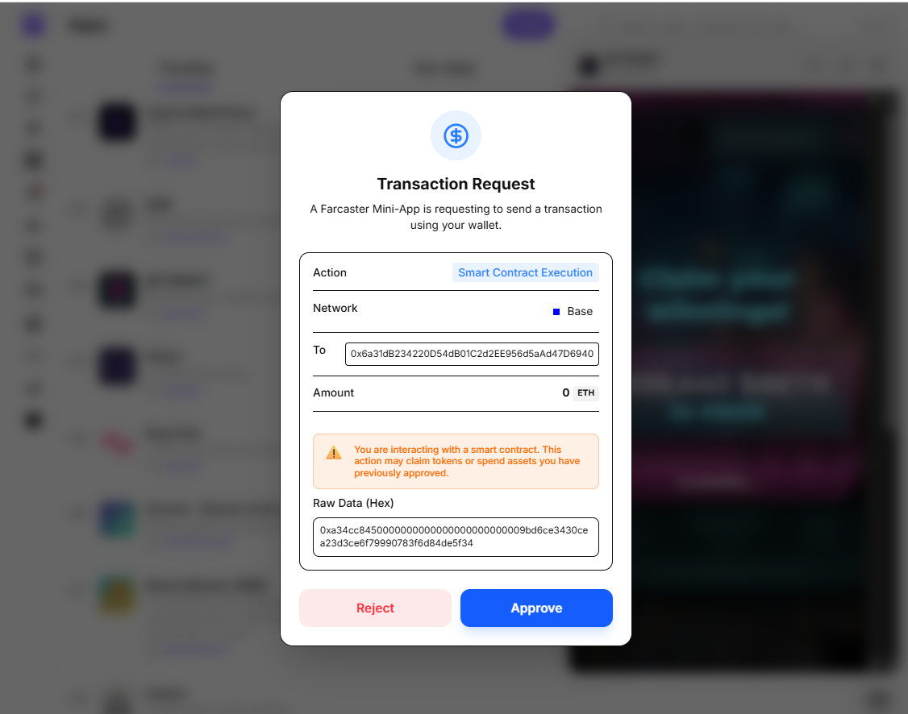

# Farcaster Client Snapshot

A fork of the [Farcaster client monorepo](https://github.com/farcasterxyz/client) with a **Native Web Wallet** integrated directly into the web app.

The original snapshot had no wallet — users had to connect an external wallet (MetaMask, Warpcast mobile, etc.). This fork adds a fully self-custodial, browser-based wallet that works natively inside the Farcaster web client and allows interaction with Mini-Apps without any external wallet extension.

> **Status:** Functional on Base and Arbitrum via the web client (`apps/farcaster-web`). Some mini-apps may not respond correctly depending on the RPC method they use. This is an open-source work in progress — contributions welcome.

> **Note on Mobile:** This integration is specifically for the Farcaster Web Client. The mobile app (`apps/farcaster-mobile`) continues to use Warpcast's native wallet and is not affected by this package.

---

## 📸 What It Looks Like

#### 🪙 Wallet — Token Balances & Activity
The wallet shows live on-chain token balances and a full transaction history.


#### 🔁 Chain Selection (9 networks supported)
Switch between Base, ETH, OP, ARB, BSC, Ink, Ronin, Robinhood, Zora from the wallet header.


#### 💸 Sending Tokens
Send native ETH or any ERC-20 token. Supports `@farcasterusername` as recipient — it resolves the address automatically.


#### 🔄 Swapping (powered by LI.FI)
Cross-chain and same-chain swaps via the LI.FI aggregator. Best route shown before execution.


#### 🎮 Interacting with Mini-Apps (BETRMINT)
The wallet injects itself as the EIP-1193 provider inside Mini-App iframes. When a mini-app (like BETRMINT Spin to Win) requests a transaction, the wallet intercepts it and shows the approval modal.


#### ✅ Claim Reward — Smart Contract Execution
When the mini-app calls `wallet_sendCalls` to claim a reward, the wallet shows the full decoded transaction before signing.


#### ✍️ Signing Typed Data (EIP-712)
USDC Permit signatures and other EIP-712 structured data requests are shown with domain and data for the user to review before approving.

---

## 🚀 Setup & Running Locally

### Prerequisites

- **Node.js** v18+ 
- **pnpm** v8+ — install with `npm install -g pnpm`
- **Git**

### Step 1 — Clone the repo

```bash
git clone https://github.com/naitikrahane/client.git
cd client
```

### Step 2 — Install dependencies

```bash
pnpm install
```

This installs dependencies for all packages in the monorepo (`farcaster-wallet`, `farcaster-web`, shared packages, etc.).

### Step 3 — Build shared packages (watch mode)

Open a **first terminal** and run:

```bash
pnpm watch
```

This compiles shared packages (including `farcaster-wallet`) in watch mode. **Keep this running.**

### Step 4 — Start the web client

Open a **second terminal** and run:

```bash
cd apps/farcaster-web
pnpm start
```

The app will be available at **http://localhost:5173**

### Step 5 — Set up your wallet

1. Go to **http://localhost:5173/~/wallet**
2. Click **"Create Wallet"** — a BIP-39 12-word mnemonic is generated
3. Set a **password** to encrypt your key (stored locally, AES-GCM-256)
4. Your wallet address is shown immediately — you can fund it from any exchange or faucet

> **Testnet faucets:** For Base testnet ETH, use [base-sepolia faucet](https://www.coinbase.com/faucets/base-ethereum-goerli-faucet). For mainnet testing, fund with a small amount.

---

## 💼 Native Wallet — Architecture

The wallet is split into two parts:

### `packages/farcaster-wallet/` (headless logic)

| File | What it does |
|------|-------------|
| `store.ts` | Singleton `WalletStore` — manages encrypted key storage, session unlock, pending request queue |
| `crypto.ts` | AES-GCM-256 encryption + PBKDF2 (600k iterations) key derivation using Web Crypto API |
| `actions.ts` | Viem-based: ETH/ERC-20 send, LI.FI swap quotes, on-chain balance reads, RPC client factory |
| `useWeb3Requests.ts` | React hook — processes `wallet_sendCalls` batch requests sequentially, waits for receipts |
| `web3Provider.ts` | EIP-1193 compatible provider injected into mini-app iframes via `window.postMessage` |
| `rpc.ts` | Base fallback RPC list — tries multiple nodes if primary fails |

### `apps/farcaster-web/src/` (UI)

| File | What it does |
|------|-------------|
| `wallet/WalletUI.tsx` | Main wallet panel — View/Send/Swap/Settings tabs, token list, activity history |
| `components/wallet/NativeWalletRequestModal.tsx` | Transaction approval modal — decodes ERC-20 transfers, approvals, EIP-712 signatures |
| `pages/wallet/WalletIframePage.tsx` | Wallet iframe page for cross-frame communication |

---

## ⚠️ Known Limitations & Honest Status

This is a work in progress. Here is what we know doesn't work perfectly yet:

| Issue | Status |
|-------|--------|
| Some mini-apps use non-standard RPC methods | ⚠️ Not all methods are implemented in `web3Provider.ts` |
| Nonce desync on rapid transactions | ⚠️ Can cause "replacement transaction underpriced" error |
| Mobile app (`farcaster-mobile`) | ❌ Not integrated — mobile uses Warpcast's native wallet |
| Gas estimation for complex contracts | ⚠️ Falls back to hardcoded gas limit if estimation fails |

**Tested and working on:** Base mainnet, Arbitrum mainnet  
**Other chains (OP, BSC, Ink, Ronin, Robinhood, Zora):** Configurable via custom RPC — not extensively tested

---

## 🔮 Future Plans

- [ ] Fix nonce management for rapid sequential transactions  
- [ ] Expand `web3Provider.ts` to handle more EIP-1193 methods  
- [ ] Add NFT display in the wallet view tab  
- [ ] Better error messages for unsupported mini-app interactions  
- [ ] Mobile wallet parity (React Native compatible storage + crypto)

---

## 🤝 Contributing

This is open source. Fork it, break it, improve it. PRs welcome.

The codebase is a standard pnpm monorepo — adding a new feature to the wallet means touching `packages/farcaster-wallet/src/` for logic and `apps/farcaster-web/src/wallet/` for UI.

---

## 👤 Author

Built by **Naitik Rahane** for the Farcaster ecosystem.

- **Farcaster:** [@naitikrahane](https://warpcast.com/naitikrahane)
- **X (Twitter):** [@Lucky012387](https://x.com/Lucky012387)
